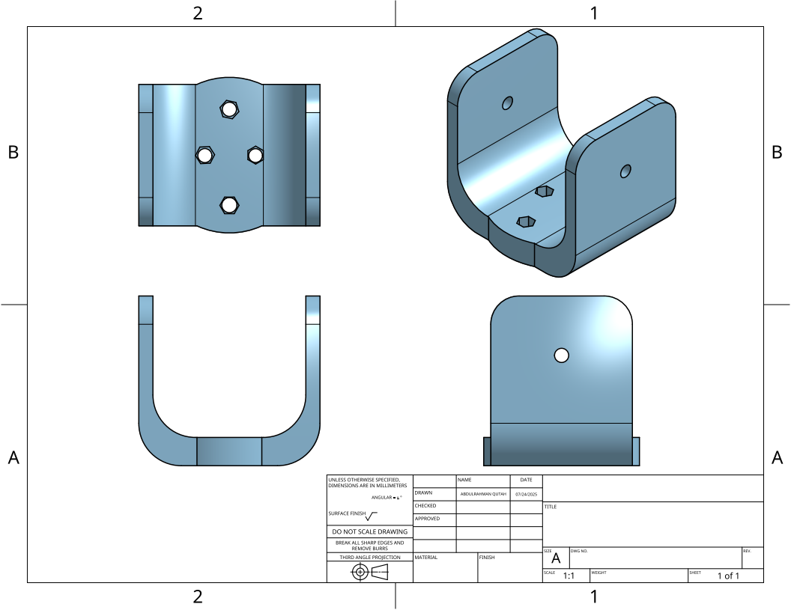

# 🔧 Mechanical Joint Improvement

This is a 3D mechanical joint improvement project designed using [Onshape](https://www.onshape.com/) and shared for public use and educational reference.

## 📂 Files Included
- `Studio.step` → Exported 3D CAD file
- `Assembly.png` → Preview of the design

## 🌐 Live View on Onshape
You can view the 3D model directly via Onshape:  
- [Live Model](https://tinyurl.com/3D-Joint)

## 📄 Description
This model was designed to enhance the structure and function of a mechanical joint using parametric modeling tools in Onshape. It includes:
- Precise dimensioning and constraints
- Editable features and assemblies
- Export settings optimized for compatibility

## 🎯 Purpose
- Created as a general mechanical design project for learning, showcasing part modeling and joint optimization techniques.

## 📸 Design Preview

---

## 👤 Author
> Designed by: [Abdulrahman Qutah]  
> Date: [24 July 2025]
